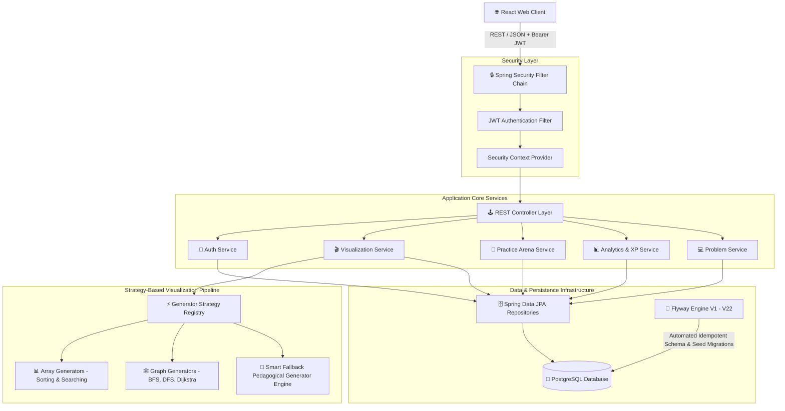

# ⚡ CodeLoom DSA Visualizer — Backend Core Engine

<div align="center">


<br/>

> **High-Performance Algorithm Execution & Pedagogical Visualization Engine**  
> *Powering step-by-step Data Structures & Algorithms execution snapshots, interactive practice arenas, analytics, and gamification.*

</div>

---

## 💡 Overview

**CodeLoom DSA Visualizer Backend** is a production-ready, RESTful micro-service built with **Java 21** and **Spring Boot 3.4+**. It executes complex algorithmic logic dynamically, producing structured, step-by-step execution snapshots (comparison states, swaps, visit order, traversal steps, array states, graph snapshots) consumed by the frontend rendering engines.

---

## 🏛️ System Architecture



---

## ⚡ Core Modules & Features

### 1. 🔑 Security & JWT Authentication
- **Stateless Authentication**: Token-based security issuing HMAC-SHA256 JWT tokens.
- **User Lifecycle**: Secure registration (`/api/v1/auth/register`) with uniqueness validation and password hashing via **BCrypt**.
- **Role-Based Authorization**: Fine-grained route protection (`ROLE_USER`, `ROLE_ADMIN`).

### 2. 🎬 Universal Visualization Strategy Engine
- **Universal Contract**: Endpoint `POST /api/v1/algorithms/{slug}/visualize` generating structured snapshot payloads.
- **Native Generators**:
  - **Sorting**: Bubble Sort, Selection Sort, Insertion Sort, Merge Sort, Quick Sort.
  - **Searching**: Linear Search, Binary Search.
  - **Graphs**: Breadth-First Search (BFS), Depth-First Search (DFS), Dijkstra's Algorithm.
- **Smart Category Fallback**: Dynamic engine serving step-by-step pedagogical visualization states for the entire 218-algorithm catalog across Arrays, Trees, Dynamic Programming, Backtracking, and String algorithms.

### 3. 🎯 Practice Arena & Session Runner
- **6 Interactive Practice Modes**: Quick Practice, Timed Sprint, Topic Focus, Streak Builder, Random Shuffle, Daily Challenge.
- **Session State Lifecycle**: Session initialization, live submission evaluation, real-time feedback, and session completion tracking (`/api/v1/practice/sessions/*`).
- **Daily Challenge Engine**: Automated daily problem rotation with bonus XP multipliers.

### 4. 📊 Analytics, XP Ledger & Leaderboards
- **Heatmap Analytics**: Daily activity tracking powering GitHub-style activity heatmaps.
- **Gamification Engine**: Dynamic XP calculations, level progression curves, streak freeze mechanics, and badge unlocks.
- **Global Leaderboards**: Real-time ranking of top learners by total XP (`/api/v1/analytics/leaderboard`).

---

## 🛠️ Technology Stack

| Component | Technology | Version | Description |
| :--- | :--- | :--- | :--- |
| **Language** | Java | 21 (LTS) | Modern Java features (Virtual Threads, Records, Pattern Matching) |
| **Framework** | Spring Boot | 3.4.3 | Enterprise REST framework |
| **Security** | Spring Security | 6.x | JWT authentication & BCrypt encryption |
| **Database** | PostgreSQL | 16+ | Relational persistence store |
| **Migrations** | Flyway | 10.x | Versioned database schema & seed migrations (`V1` to `V22`) |
| **Containerization** | Docker | 24+ | Multi-stage Alpine container runtime |
| **Build Tool** | Apache Maven | 3.9+ | Dependency management & compilation |
| **Testing** | JUnit 5 & MockMvc | 5.x | Unit & integration testing suite |

---

## 📡 REST API Reference Summary

| Endpoint | Method | Security | Description |
| :--- | :---: | :---: | :--- |
| `/api/v1/auth/register` | `POST` | Public | Register new user account |
| `/api/v1/auth/login` | `POST` | Public | Authenticate user & return JWT token |
| `/api/v1/algorithms` | `GET` | Public | Fetch catalog of algorithms |
| `/api/v1/algorithms/{slug}` | `GET` | Public | Get detailed algorithm info & code snippets |
| `/api/v1/algorithms/{slug}/visualize` | `POST` | Public | Generate step-by-step animation snapshots |
| `/api/v1/practice/arena` | `GET` | User | Get user practice arena hub data |
| `/api/v1/practice/sessions` | `POST` | User | Start a new practice session |
| `/api/v1/practice/sessions/{id}/submit` | `POST` | User | Submit problem within active session |
| `/api/v1/analytics/stats` | `GET` | User | Fetch streak, XP, heatmap, and badge stats |
| `/api/v1/analytics/leaderboard` | `GET` | Public | Global user XP leaderboard ranking |

---

## 🚀 Quick Start Guide

### Prerequisites
- **Java 21** or higher
- **Maven 3.9+** (or use included `./mvnw`)
- **PostgreSQL 16+** running on `localhost:5432`

### 1. Database Setup
Create the target PostgreSQL database:
```sql
CREATE DATABASE dsa_visualizer;
```

### 2. Configure Environment Variables / Properties
Default values are set in `src/main/resources/application.properties`. You can override them using environment variables:
```bash
export SPRING_DATASOURCE_URL=jdbc:postgresql://localhost:5432/dsa_visualizer
export SPRING_DATASOURCE_USERNAME=postgres
export SPRING_DATASOURCE_PASSWORD=postgres
export JWT_SECRET=404E635266556A586E3272357538782F413F4428472B4B6250645367566B5970
```

### 3. Run Application
```bash
./mvnw clean spring-boot:run
```
The server will start on **`http://localhost:8080`**. Flyway migrations will run automatically on startup to initialize database tables and seed data.

---

## 🐳 Docker Deployment

To build and run the backend using Docker:

```bash
# 1. Build Docker Image
docker build -t codeloom-dsa-backend .

# 2. Run Docker Container
docker run -d -p 8080:8080 \
  -e SPRING_DATASOURCE_URL=jdbc:postgresql://host.docker.internal:5432/dsa_visualizer \
  -e SPRING_DATASOURCE_USERNAME=postgres \
  -e SPRING_DATASOURCE_PASSWORD=postgres \
  -e JWT_SECRET=404E635266556A586E3272357538782F413F4428472B4B6250645367566B5970 \
  --name dsa-backend codeloom-dsa-backend
```

---

## 🧪 Testing Suite

Execute the full backend test suite (Unit & Integration tests):

```bash
./mvnw clean test
```

---

## 📜 License

Distributed under the **MIT License**.
