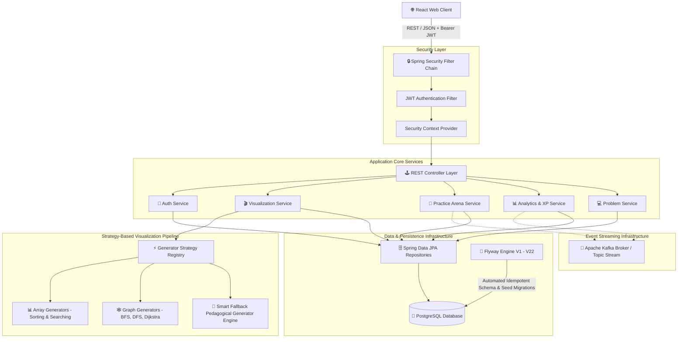

# ⚡ CodeLoom DSA Visualizer — Backend Core Engine

<div align="center">

  <a href="https://git.io/typing-svg">
    
  </a>

  <br/>
  <br/>

  
  
  
  
  
  

  <br/>

  > **High-Performance Algorithm Execution & Event-Driven Microservice**  
  > *Delivering real-time step execution snapshots, user authorization, practice arena session state management, and event-driven analytics.*

</div>

---

## 🌟 Feature Highlights

<table width="100%">
  <tr>
    <td width="33%" align="center">
      <h3>⚡ Universal Generators</h3>
      <p><code>🎬 SNAPSHOT PIPELINE</code></p>
      <p>Strategy registry executing step-by-step state snapshot arrays across Sorting, Searching, Graphs & Smart Fallback generators.</p>
    </td>
    <td width="33%" align="center">
      <h3>📡 Event Streaming</h3>
      <p><code>📡 APACHE KAFKA BUS</code></p>
      <p>Asynchronous event processing for practice evaluation results, user streak updates & analytics events.</p>
    </td>
    <td width="33%" align="center">
      <h3>🔒 Enterprise Security</h3>
      <p><code>🔑 JWT + FLYWAY DB</code></p>
      <p>Stateless Spring Security JWT authorization filter with BCrypt password hashing & Flyway idempotent schema versioning.</p>
    </td>
  </tr>
</table>

---

## 🏛️ System Architecture



---

## ⚡ Core Engine Modules

<details open>
<summary><b>🎬 1. Universal Visualization Strategy Engine</b></summary>
<br/>

- **Universal Snapshot API**: `POST /api/v1/algorithms/{slug}/visualize` generating structured snapshot state sequences.
- **Native Algorithmic Generators**:
  - **Sorting**: Bubble Sort, Selection Sort, Insertion Sort, Merge Sort, Quick Sort.
  - **Searching**: Linear Search, Binary Search.
  - **Graphs**: Breadth-First Search (BFS), Depth-First Search (DFS), Dijkstra's Shortest Path.
- **Smart Category Fallback**: Dynamic engine providing pedagogical step states for all 218 catalog algorithms across Arrays, Trees, Dynamic Programming, Backtracking, and Strings.
</details>

<details open>
<summary><b>🎯 2. Practice Arena & Session State Manager</b></summary>
<br/>

- **Interactive Practice Modes**: Quick Practice, Timed Sprint, Topic Focus, Streak Builder, Random Shuffle, Daily Challenge.
- **Session Lifecycle APIs**: Session initialization, active session resuming, submission processing, and completion validation (`/api/v1/practice/sessions/*`).
</details>

<details open>
<summary><b>📊 3. Analytics, XP Ledger & Kafka Event Bus</b></summary>
<br/>

- **Event Bus Integration**: **Apache Kafka** event producer streaming practice submissions, XP events, and telemetry.
- **Gamification Logic**: XP calculation curves, streak protection mechanics, badge triggers, and GitHub-style heatmap data generation.
- **Leaderboards**: Ranked user leaderboard endpoint (`GET /api/v1/analytics/leaderboard`).
</details>

---

## 🛠️ Technology Stack

| Component | Technology | Version | Description |
| :--- | :--- | :--- | :--- |
| **Language** | Java | 21 (LTS) | Modern Java features (Virtual Threads, Records, Sealed Classes) |
| **Framework** | Spring Boot | 3.4.3 | Enterprise REST framework |
| **Security** | Spring Security | 6.x | Stateless JWT authentication & BCrypt password hashing |
| **Messaging** | Apache Kafka | 3.x | Distributed event stream bus (`spring-boot-starter-kafka`) |
| **Database** | PostgreSQL | 16+ | Production relational persistence store |
| **Migrations** | Flyway | 10.x | Versioned database schema & seed migrations (`V1` to `V22`) |
| **Containerization** | Docker | 24+ | Multi-stage Alpine JVM container runtime |
| **Build Tool** | Apache Maven | 3.9+ | Dependency management & compilation |
| **Testing** | JUnit 5 & MockMvc | 5.x | Unit & integration testing suite |

---

## 📡 REST API Reference Summary

<details>
<summary><b>📋 Expand Endpoint Table</b></summary>
<br/>

| Endpoint | Method | Security | Description |
| :--- | :---: | :---: | :--- |
| `/api/v1/auth/register` | `POST` | Public | Register new user account |
| `/api/v1/auth/login` | `POST` | Public | Authenticate user & return JWT token |
| `/api/v1/algorithms` | `GET` | Public | Fetch algorithm catalog |
| `/api/v1/algorithms/{slug}` | `GET` | Public | Get detailed algorithm info & code snippets |
| `/api/v1/algorithms/{slug}/visualize` | `POST` | Public | Generate step-by-step snapshot animations |
| `/api/v1/practice/arena` | `GET` | User | Get user practice arena hub data |
| `/api/v1/practice/sessions` | `POST` | User | Start a new practice session |
| `/api/v1/practice/sessions/{id}/submit` | `POST` | User | Submit problem within active session |
| `/api/v1/analytics/stats` | `GET` | User | Fetch user streak, XP, heatmap & badge stats |
| `/api/v1/analytics/leaderboard` | `GET` | Public | Global user XP leaderboard ranking |
</details>

---

## 🚀 Quick Start Guide

### 1. Prerequisites
- **Java 21** or higher
- **Maven 3.9+** (or included `./mvnw`)
- **PostgreSQL 16+** running on `localhost:5432`
- **Apache Kafka** running on `localhost:9092` (optional)

### 2. Database & Setup
Create target PostgreSQL database:
```sql
CREATE DATABASE dsa_visualizer;
```

### 3. Execution Commands
```bash
# Configure Environment Variables
export SPRING_DATASOURCE_URL=jdbc:postgresql://localhost:5432/dsa_visualizer
export SPRING_DATASOURCE_USERNAME=postgres
export SPRING_DATASOURCE_PASSWORD=postgres
export JWT_SECRET=404E635266556A586E3272357538782F413F4428472B4B6250645367566B5970
export KAFKA_SERVERS=localhost:9092

# Build & Run Backend Application
./mvnw clean spring-boot:run
```

The Spring Boot backend will start on **`http://localhost:8080`**.

---

## 🐳 Docker Deployment

```bash
# 1. Build Docker image
docker build -t codeloom-backend .

# 2. Launch container
docker run -d -p 8080:8080 \
  -e SPRING_DATASOURCE_URL=jdbc:postgresql://host.docker.internal:5432/dsa_visualizer \
  -e SPRING_DATASOURCE_USERNAME=postgres \
  -e SPRING_DATASOURCE_PASSWORD=postgres \
  -e JWT_SECRET=404E635266556A586E3272357538782F413F4428472B4B6250645367566B5970 \
  -e KAFKA_SERVERS=host.docker.internal:9092 \
  --name dsa-backend codeloom-backend
```

---

## 🧪 Testing Suite

Run all unit & integration tests:
```bash
./mvnw clean test
```

---

## 📜 License

Distributed under the **MIT License**.
